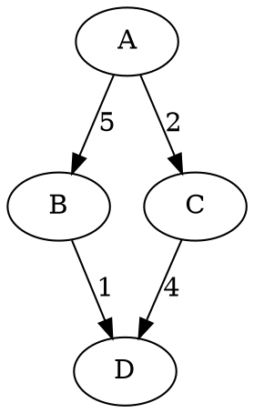

# Fordmin - Algorithme de Ford pour le plus court chemin

Application web de recherche opérationnelle implémentant l'algorithme de Ford (minimisation) pour trouver le plus court chemin dans un graphe orienté pondéré.

## Fonctionnalités

- Calcul du plus court chemin entre deux sommets
- Détection des cycles absorbants
- Affichage de tous les chemins optimaux (si multiples)
- Visualisation interactive du graphe avec Cytoscape.js
- Import/Export de graphes aux formats JSON et DOT
- Exemples intégrés
- Interface responsive

## Stack technique

- **Backend** : Flask (Python)
- **Frontend** : HTML/CSS/JS, Cytoscape.js
- **Conteneurisation** : Docker & Docker Compose

## Prérequis

- Docker
- Docker Compose

## Installation et lancement

1. Cloner le dépôt

```bash
git clone https://github.com/ndrianja04/ro.git
cd fordmin
```

2. Construire et lancer les conteneurs

```bash
docker compose build --no-cache
docker compose up
```

3. Accéder à l'application

Ouvrir un navigateur à l'adresse : http://localhost:8080

Utilisation

Saisie manuelle d'un graphe

1. Renseigner les sommets de départ et d'arrivée
2. Ajouter des arcs avec le bouton +
3. Pour chaque arc, indiquer : départ, arrivée, poids
4. Cliquer sur Calculer le chemin

Import d'un graphe

· Format JSON : structure identique à l'export
· Format DOT : syntaxe Graphviz (exemple ci-dessous)



Export

· Exporter le graphe courant au format JSON ou DOT
· Personnaliser le nom du fichier avant export

Exemples intégrés

· Exemple 1 : graphe du cours (X1 à X16)
· Exemple 2 : petit graphe de test (A à D)

Visualisation

· Les nœuds sont déplaçables
· Zoom/Pan avec la souris
· Les arcs du chemin optimal sont surlignés en orange
· Boutons Ajuster la vue et Réinitialiser layout

Structure du projet

```
├── backend/
│   ├── app.py          # API Flask
│   ├── ford.py         # Implémentation de l'algorithme
│   └── requirements.txt
├── frontend/
│   ├── index.html      # Interface utilisateur
│   ├── script.js       # Logique frontend
│   ├── style.css       # Styles
│   ├── nginx.conf      # Configuration du proxy
│   └── lib/            # Bibliothèques locales (Cytoscape)
├── data/               # Exemples de graphes JSON
├── Dockerfile.backend
├── Dockerfile.frontend
└── docker-compose.yml
```

Format des données JSON

```json
{
  "source": "X1",
  "target": "X16",
  "arcs": [
    {"from": "X1", "to": "X2", "weight": 10},
    {"from": "X2", "to": "X3", "weight": 15}
  ]
}
```

Arrêt de l'application

```bash
docker compose down
```